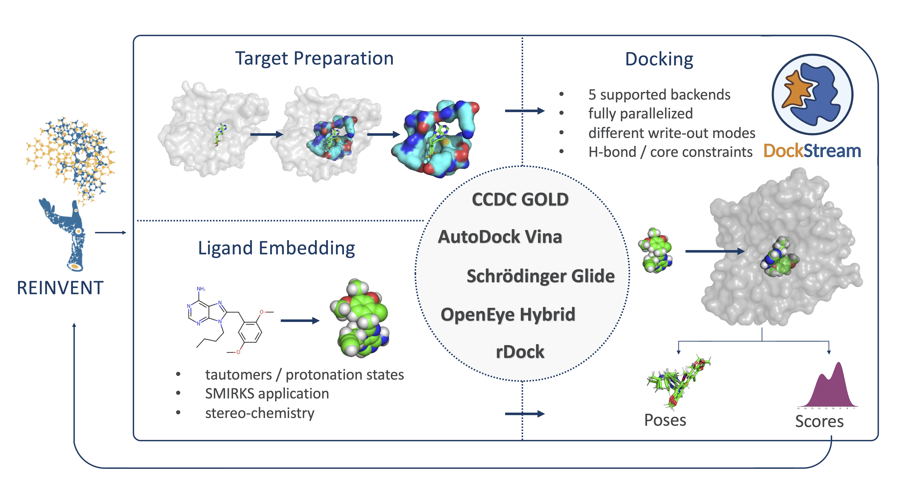

# `DockStream`


## Description
DockStream is a docking wrapper providing access to a collection of ligand embedders and docking backends.
Docking execution and post hoc analysis can be automated via the benchmarking and analysis workflow. The
flexilibity to specifiy a large variety of docking configurations allows tailored protocols for diverse 
end applications. DockStream can also parallelize docking across CPU cores, increasing throughput.
DockStream is integrated with the de novo design platform, [REINVENT](https://github.com/MolecularAI/Reinvent),
allowing one to incorporate docking into the generative process, thus providing the agent with 3D
structural information.

## Supported Backends
### Ligand Embedders
* **[`RDKit`](https://www.rdkit.org/docs/GettingStartedInPython.html#working-with-3d-molecules)**
* **[`Corina`](https://www.mn-am.com/products/corina)**
* **[OpenEye's `OMEGA`](https://www.eyesopen.com/omega)**
* **[Schrodinger's `LigPrep`](https://www.schrodinger.com/products/ligprep)**
* **[`TautEnum`](https://github.com/OpenEye-Contrib/TautEnum/blob/master/README)**

### Docking Backends
* **[`AutoDock Vina`](http://vina.scripps.edu/index.html)**
* **[`rDock`](http://rdock.sourceforge.net)**
* **[OpenEye's `Hybrid`](https://www.eyesopen.com/oedocking-tk)**
* **[Schrodinger's `Glide`](https://www.schrodinger.com/glide)**
* **[CCDC's `GOLD`](https://www.ccdc.cam.ac.uk/solutions/csd-discovery/components/gold)**

Note: The `CCDC` package, the `OpenEye` toolkit and `Schrodinger`'s tools require you to obtain the respective software from those vendors.

## Tutorials and Usage
Detailed `Jupyter Notebook` tutorials for all `DockStream` functionalities and workflows are provided in 
[DockStreamCommunity](https://github.com/MolecularAI/DockStreamCommunity). The `DockStream` repository here 
contains input `JSON` templates located in [examples](https://github.com/MolecularAI/DockStreamCommunity/examples).
The templates are organized as follows:
* `target_preparation`: Preparing targets for docking
* `ligand_preparation`: Generating 3D coordinates for ligands
* `docking`: Docking ligands
* `integration`: Combining different ligand embedders and docking backends into a single input `JSON` to run successively

## Using DockStream in REINVENT
DockStream provides a flexible implementation of molecular docking as a scoring function component in REINVENT. The generative 
agent is able to gradually generate compounds that satisfy the DockStream component, i.e, achieve favourable docking scores. 
A [tutorial notebook](https://github.com/MolecularAI/ReinventCommunity/blob/master/notebooks/Reinforcement_Learning_Demo_DockStream.ipynb) is provided.

## Requirements
Two Conda environments are provided: `DockStream` via `environment.yml` and `DockStreamFull` via `environment_full.yml`.
`DockStream` suffices for all use cases except when `CCDC GOLD` software is used, in which case `DockStreamFull` is required.
```
git clone <DockStream repository>
cd <DockStream directory>
conda env create -f environment.yml
conda activate DockStream
```

## Enable use of OpenEye software (from [REINVENT README](https://github.com/MolecularAI/Reinvent))
You will need to set the environmental variable OE_LICENSE to activate the oechem license.
One way to do this and keep it conda environment specific is:
On the command-line, first:

```
cd $CONDA_PREFIX
mkdir -p ./etc/conda/activate.d
mkdir -p ./etc/conda/deactivate.d
touch ./etc/conda/activate.d/env_vars.sh
touch ./etc/conda/deactivate.d/env_vars.sh
```

Then edit ```./etc/conda/activate.d/env_vars.sh``` as follows:

```
#!/bin/sh
export OE_LICENSE='/opt/scp/software/oelicense/1.0/oe_license.seq1'
```

and finally, edit ./etc/conda/deactivate.d/env_vars.sh :

```
#!/bin/sh
unset OE_LICENSE
```

## Unit Tests
After cloning the `DockStream` repository, enable licenses, if applicable (`OpenEye`, `CCDC`, `Schrodinger`). Then execute the following:
```
python unit_tests.py
```

## Contributors
Christian Margreitter (christian.margreitter@astrazeneca.com)
Jeff Guo (jeff.guo@astrazeneca.com)
Alexey Voronov (alexey.voronov1@astrazeneca.com)
